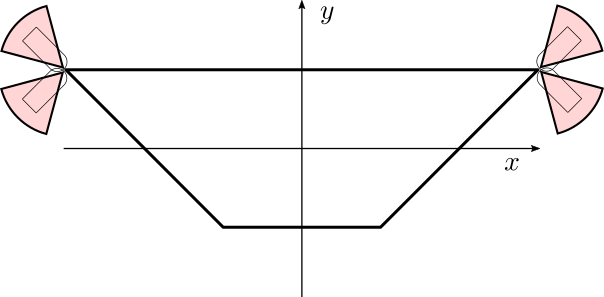

# Week 4

Francesco Iori

## Q1

**Q1.1**

Let's consider 
$$
\begin{equation}
f_{ext} =
\begin{pmatrix}
	f_{bx}\\
	f_{by}\\
	\tau_{bz}
\end{pmatrix} =
\begin{pmatrix}
	\cos(\theta)\\
	\sin(\theta)\\
	0
\end{pmatrix}
\label{eqn:f_ext}
\end{equation}
$$
If we write the equations for the left finger, using the inverse of the grasp matrix, we have
$$
\begin{cases}
f_{x1} = 0.5 f_{bx} + f_{int} \\
f_{y1} = 0.5 f_{by}
\end{cases}
$$

Substituting ($\ref{eqn:f_ext}$) and considering that, to respect the friction constraint, it has to be $\mu \, f_{x1} \geq f_{y1}$, we find
$$
f_{int} \geq \sin(\theta) - 0.5 \cos(\theta)
$$
 In the worst case we have that the lower for $f_{int}$ is
$$
f_{int} \geq \max_{\theta} \left[\sin(\theta) - 0.5\,cos(\theta)\right]\simeq 1.118 \\
\text{ with }(\theta\simeq 2.034\:rad)
$$
thus,
$$
f_{1x} = 0.5\,\cos(\theta) + f_{int} \simeq 0.895
$$

**Q1.2**

Again, considering the equations resulting from both cases, we have
$$
G_{left}\rightarrow
\theta \in \left[-\frac{\pi}{2}, \frac{\pi}{2}\right]\rightarrow
\begin{cases}
f_{x1} = f_{int} \\
f_{y1} = 0.5 \: f_{yb}
\end{cases}
\hskip{0.8cm} |
\hskip{0.8cm}
G_{right}\rightarrow
\theta \in \left[\frac{\pi}{2}, \frac{3}{2}\pi\right]\rightarrow
\begin{cases}
f_{x1} = f_{xb} + f_{int} \\
f_{y1} = 0.5 \: f_{yb}
\end{cases}
$$
Proceeding like in Q1.1, we have, to respect the friction constraint
$$
G_{left}\rightarrow\begin{cases}
f_{int} \geq \sin(\theta) 				& \theta \in \left[-\frac{\pi}{2}, \frac{\pi}{2}\right]\\
f_{int} \geq \sin(\theta)-\cos(\theta) & \theta \in \left[\frac{\pi}{2}, \frac{3}{2}\pi\right]
\end{cases}
$$
The worst case i respresented by $\theta = \frac{\pi}{2}$, where we have $f_{int} \geq 1.0$, which represent the minimum to prevent slipping.

The value of $f_{x1}$ in this case is $1.0$ 

### Q2

###### Q 2.1

To include the origin in the convex hull the fingers must be able to exert a (total) force in all directions, requiring 
$$
\mu > 1.0
$$
Physically, this means that the fingers on the sides of the trapezoid can also exert a force with a negative $y$-axis component.

###### Q 2.2

Let’s consider that the resulting force on the object, $f_b$:

- does not depend on the position of the contact (upper part of the grasp matrix);
- due to friction, it depends on how the contact surfaces are oriented;

and that the resulting torque on the object, $\tau_b$, is linearly affected by the position of the contacts AND the orientation of the contact surfaces, due to friction.

To maximize the convex hull, we can consider to be in the limit case where each finger is exerting the maximum amount of force (max $f_{ix}$ and $f_{iy}$, i.e.  limit of the friction cone).

To maximize the resulting $f_b$ on the object we would like our contact to be able to exert a force equal in all direction (e.g. if the shape was a cube, placing one finger on each side). 

Placing one finger on top and one on the bottom solve this issue for the $y$ component. For the $x$ component we would like to have one finger on both the lateral sides of the trapezoid, even if they are not oriented normally to the $x$-axis.

For $\tau_b$ we have an heuristic “opposite” to the one for resisting forces on the $y$-axis, i.e. placing the fingers as far as possible from the origin, and oriented such at the limit (max $f_{ix}$ and $f_{iy}$, limit of the friction cone). This would mean placing two fingers on the upper corner of the object, far away from the origin.

After some experimenting, the highest value I found was with

```python
frames[0, :] = [-3, 1, 3*np.pi/4]
frames[1, :] = [3, 1, np.pi/4]
frames[2, :] = [-3, 1, -3*np.pi/4]
frames[3, :] = [3, 1, -np.pi/4]
```

with a grasp quality given by the Convex Hull of the Union **= 0.6729**

This is found assuming that, on the corner of the trapezoid, the finger can be placed with any orientation that is in the range given by the normals to the two surfaces forming that corner.



###### Q 2.3

For the same placement, the quality of the grasp given by the Convex Hull of the Minkowski sum is **= 1.41**

This value is higher because, to generate the convex hull, it considers all the possible combination of the contact forces. On the other hand, the union operation is very conservative, as (at most, considering that all points generate a vertex of the convex hull) it considers only a weighted mean of the contact forces (instead of their sum).

