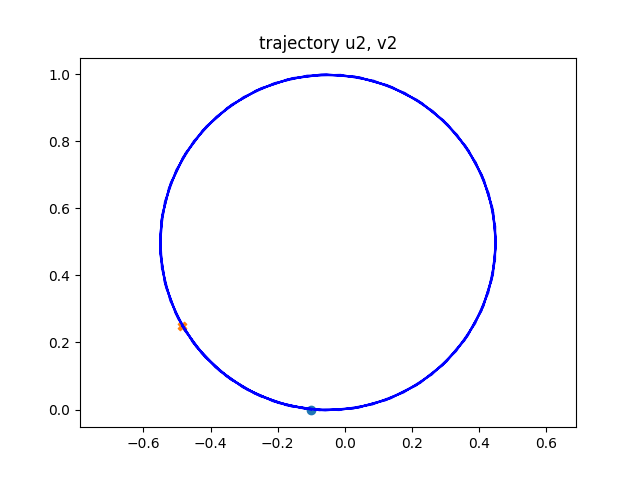

# Week 5

Francesco Iori

### Q 1

```python
# We leave the derivation of the [T] and [M] matrices as an exercise
# for the reader :-) You will similarly use eq (8) and (9)
from sympy import diag
xuu = simplify(diff(xu, u))
xuv = simplify(diff(xu, v))

Tb = Matrix([list(xuu/normpu), list(xuv/normpvpos)]).transpose()

T = yu.transpose() * Tb
T = simplify(T)
print("\nT = ")
pprint(T)

M = diag(normpu, normpvpos)
print("\nM = ")
pprint(M)
```

which results in

```console
T = 
⎡   -tan(u) ⎤
⎢0  ────────⎥
⎣      R    ⎦

M = 
⎡R     0    ⎤
⎢           ⎥
⎣0  R⋅cos(u)⎦
```

same as in Montana’s paper.

### Q 2

###### Q 2.1

I would expect the contact point to move with $v_y = - \omega_x \cross r$ (in the plane reference frame), similarly to a cylindrical wheel. SO the point should move in the negative $y$-axis direction.

The result from the script matches the expectation.

###### Q 2.2

Considering 
$$
\omega =
\begin{pmatrix}
	0 \\
	\omega_y \\
	\omega_z
\end{pmatrix}
\qquad
\forall \quad
\omega_y , \, \omega_z \in \R 
$$
The ball describe a circular trajectory of radius $r=\frac{\omega_y}{\omega_z}$.

Example for $\omega_y = 1.0, \, \omega_z=2.0$ ($r=0.5$)





###### Q 2.3

It is interesting to note that we do not obtain a circle if we set $\omega = (\omega_x, 0, \omega_z )$. This can be also be seen by inspecting $\dot{u}_2 \text{ and } \dot{\psi}$, for which we have
$$
\begin{align}
	\dot{\bf u}_2 &=
		\begin{pmatrix}
			-\omega_x \sin(\psi) - 	\omega_y \cos(\psi) \\
			-\omega_x \cos(\psi) + \omega_y \sin(\psi)
		\end{pmatrix}\\
	\dot{\psi} &= \omega_x \tan(u_2) + \omega_z
\end{align}
$$
To describe a circle on the plane we would like to have $\dot{\bf u}_2 $ in a form similar to $(\cos(\theta) ,\, sin(\theta))$, but the $\tan(u_2)$ term introduce an extra dependency on $u_2$. This term can be attributed to how the sphere is parametrized in the example being considered, and can be traced back to how the torsion matrix $T$ is defined for the sphere.
