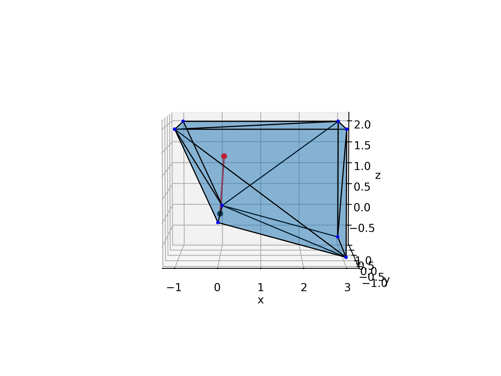
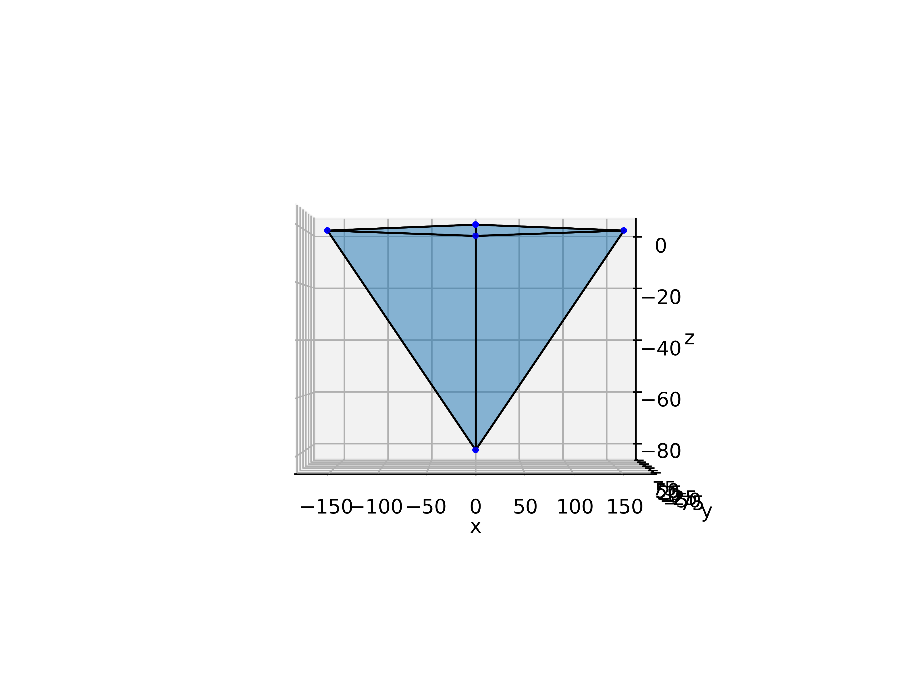
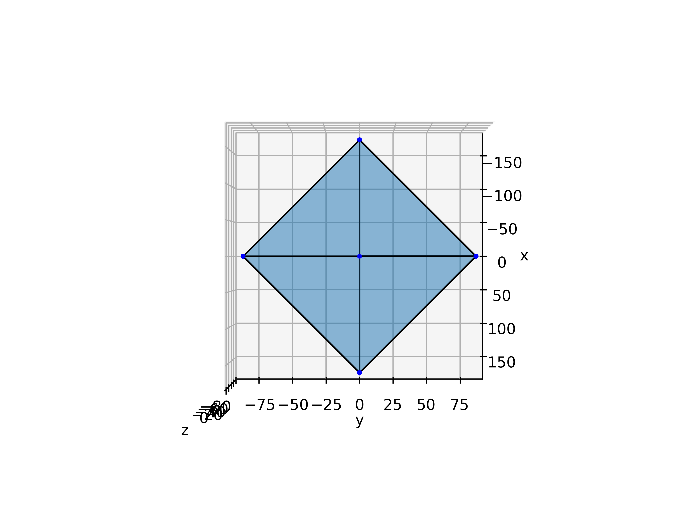
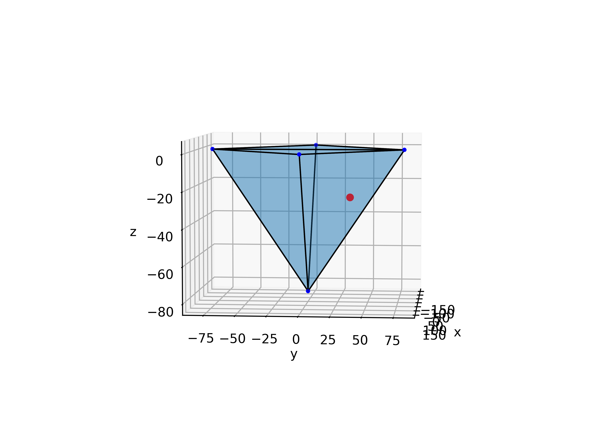

# Week 7

Francesco Iori

## Q1

###### Q1.1

Modifying the script to substitute the given values and include $f_{bias}$ as

```python
# Already in local contact coordinats
fbias = Symbol('fbias', real=True)
fbs1 = Matrix((fbias, 0, fbias))
fbs2 = - fbs1

f1 = df1 + fbs1
f2 = df2 + fbs2

pprint(f1)

ksl_v, ksn_v = 500, 100
dbx_v, dbz_v = -2e-3, -2e-3
fbias_v = 0

print("\n----- Q1.1 -----")
print("\n--- f1: ")
pprint(f1.subs([[ksn, ksn_v], [ksl, ksl_v], [
       dbx, dbx_v], [dbz, dbz_v], [fbias, fbias_v]]))
print("\n--- f2: ")
pprint(f2.subs([[ksn, ksn_v], [ksl, ksl_v], [
       dbx, dbx_v], [dbz, dbz_v], [fbias, fbias_v]]))
```

We can then compute the value of the force at each contact, in local coordinates (for now, considering $f_{bias}=0$), and we find
$$
f_i =
\begin{pmatrix}
	-1 \\
	0 \\
	0.2
\end{pmatrix}
$$
Which is outside the convex hull


###### Q1.2

Considering that, in local contact coordinates, we have
$$
f_i = \begin{pmatrix}
	-1 \\
	0 \\
	0.2
\end{pmatrix}
+
\begin{pmatrix}
	f_{bias} \\
	0 \\
	f_{bias}
\end{pmatrix}
$$
we can choose, for example, $f_{bias} = 1.1$ to have a result inside the convex hull




## Q2

For this part I will be referring to the script `Q2.py`, attached to the solution

###### Q2.1

We can proceed similarly to Q1.1 to compute how a wrench applied at a point in body coordinate (the origin, in this case), considering the `Jbtran` matrix with the correct value of translation and rotation between the two reference frame.

With this procedure we obtain
$$
w_1:
\left[\begin{matrix}f_x\\f_y\\f_z\\0.2 f_z\\- 0.1 f_z\\- 0.2 f_x + 0.1 f_y\end{matrix}\right]
\quad
w_2:
\left[\begin{matrix}f_x\\f_y\\f_z\\- 0.2 f_z\\- 0.1 f_z\\0.2 f_x + 0.1 f_y\end{matrix}\right]
\quad
w_3:
\left[\begin{matrix}f_x\\f_y\\f_z\\- 0.2 f_z\\0.1 f_z\\0.2 f_x - 0.1 f_y\end{matrix}\right]
\quad
w_4:
\left[\begin{matrix}f_x\\f_y\\f_z\\0.2 f_z\\0.1 f_z\\- 0.2 f_x - 0.1 f_y\end{matrix}\right]
$$


###### Q2.2

As we have seen in class, given that:

- the load is equally distributed on each unit
-  they are all oriented in the same way

 the limit surface is a scaled version of the one for a single unit (4x).

We can plot the surface resuming the methods in `Vector-in-ConvexHull.py`

<p float="left">
  
</p>

<p float="left">
   
  
</p>


###### Q2.3

The maximum value of a force directed like $(7,7,-5)^T$ that the mechanism can hold is given by the intersection of a line in this direction with the limit surface.

Again, resuming the methods of `Vector-in-ConvexHull.py`, we find 
$$
f_{max} =
\left[\begin{matrix}
    36.19\\
    36.19\\
    -25.85
\end{matrix}\right]
$$




